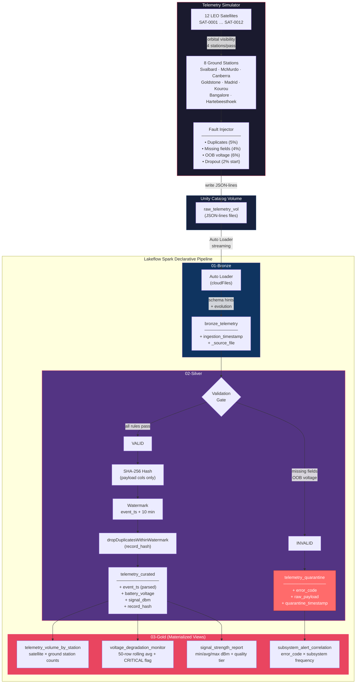

# OrbitalSense — Architecture Diagram

## System Overview

The diagram below shows the end-to-end data flow from satellite telemetry
generation through the Medallion Architecture (Bronze → Silver → Gold),
including the quarantine (dead-letter) routing for malformed records,
SHA-256 deduplication mechanics, and watermark handling for late-arriving data.



## Data Flow Detail

### Happy Path (Nominal Telemetry)

```
Satellite → Ground Station → JSON-lines file → UC Volume
  → Auto Loader (Bronze) → Validation Gate (PASS)
  → SHA-256 Hash → Watermark (10 min) → Dedup → telemetry_curated
  → Gold MVs (volume, voltage, signal, subsystem)
```

### Quarantine Path (Malformed Data)

```
Satellite → Ground Station → JSON-lines file → UC Volume
  → Auto Loader (Bronze) → Validation Gate (FAIL)
  → error_code assigned → raw_payload preserved → telemetry_quarantine
  → subsystem_alert_correlation (Gold)
```

### Deduplication Mechanics

1. **Hash computation**: SHA-256 over `satellite_id || event_timestamp ||
   subsystem || ground_station_id || metrics` — ingestion metadata excluded
   to ensure identical payloads produce the same hash regardless of when
   they were ingested.
2. **Watermark**: 10-minute window on `event_ts` bounds Spark state.
   Duplicate records arriving within 10 minutes of the original are dropped.
3. **Late data**: Records arriving after the watermark closes are still
   processed if they pass validation, but they will not be deduped against
   records that have already left the state store.

### Late-Arriving Data & Watermark

```
Time ──────────────────────────────────────────────────►

  event_ts = T        event_ts = T + 8min    event_ts = T + 12min
  ┌───────┐           ┌───────┐              ┌───────┐
  │ SAT-1 │           │ SAT-1 │              │ SAT-1 │
  │ hash: │           │ hash: │              │ hash: │
  │  abc   │           │  abc   │              │  abc   │
  └───┬───┘           └───┬───┘              └───┬───┘
      │                   │                      │
      ▼                   ▼                      ▼
  ACCEPTED            DEDUP DROP             ACCEPTED
  (first seen)        (within 10m            (watermark expired;
                       watermark)             state evicted;
                                              treated as new)
```

### Satellite Dropout Scenario

```
Batch 1    Batch 2    Batch 3    Batch 4    Batch 5    Batch 6
  SAT-3      SAT-3    [DROPOUT]  [DROPOUT]  [DROPOUT]    SAT-3
 reports   reports     silent     silent     silent     resumes

  Bronze     Bronze    (nothing)  (nothing)  (nothing)   Bronze
  Silver     Silver                                      Silver
                       └─── No records generated ───┘
                            (gap in time series)
```

Dropout windows create gaps in the Gold time-series aggregations. The
`voltage_degradation_monitor` rolling window naturally shrinks during
dropout periods and recovers when the satellite resumes reporting.
